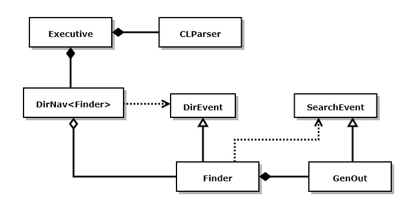

# BuildOn

https://JimFawcett.github.io/BuildOn.html

BuildOn is a sequence of remote presentations about a "TextFinder" application. 
- Presentations are made to a small group of developers interested in learning Rust
- We are developing the TextFinder application in parts and discussing relevant Rust ideas for each part
- You can find videos for each presentation linked from this site's <a href="https://jimfawcett.github.io/SiteMap.html">SiteMap</a> 

Home for remote collaboration on learning Rust (other languages later)
- Repository now contains starter code for Steps #1 and #2.
- After each remote session I will put my solution code here as well.  
- Now has complete solution (BuildOn-5) but does not yet contain extensions for RegEx and parallel text search

Visit the doc page, linked above, for details about BuildOn.
